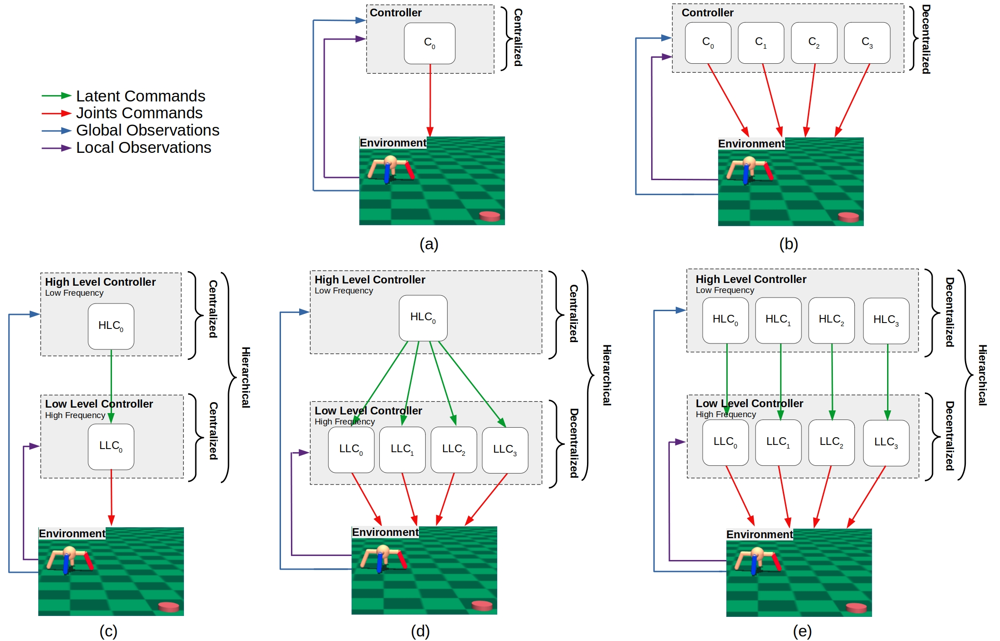

# HDDRL
Hierarchical Decentralized Deep Reinforcement Learning

**Status:** Archive (code is provided as-is, no updates expected)

**Figure:** Visualization of the compared architectures:

(a): Centralized architecture with one controller (C<sub>0</sub>).

(b): Fully decentralized architecture with four different controllers (C<sub>0</sub>, C<sub>1</sub>, C<sub>2</sub>, C<sub>1</sub>). 

(c): Hierarchical architecture with 1 HLC and 1 LLC. 

(d): Hierarchical decentralized architecture with 1 HLC and 4 LLCs. 

(e): Hierarchical decentralized architecture with 4 HLCs and 4 LLCs.



# Install

Install the conda package manager from https://docs.conda.io/en/latest/miniconda.html

```
# Required: Sampling
conda create --name hddrl python=3.6.13
conda activate hddrl
git clone https://github.com/wzaiealmri/hddrl.git
cd hddrl
pip install -r requirements.txt
pip install -e .
```

# Citation

```
@article{wzaielamri_HDRL,
  title={
Hierarchical Decentralized Deep Reinforcement Learning Architecture for a Simulated Four-Legged Agent.},
  author={Wadhah Zai El Amri, Luca Hermes, Malte Schilling},
  journal={Proc. of 8th International Online & Onsite Conference on Machine Learning, Optimization, and Data Science.},
  year={2022}
}
```
